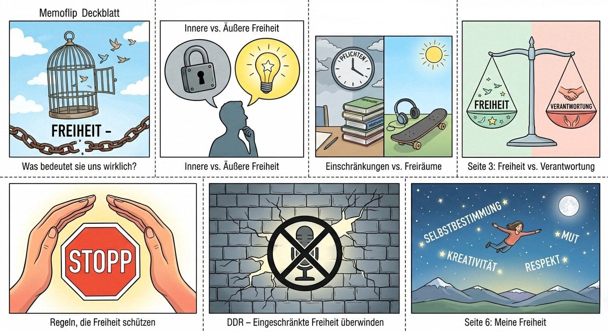
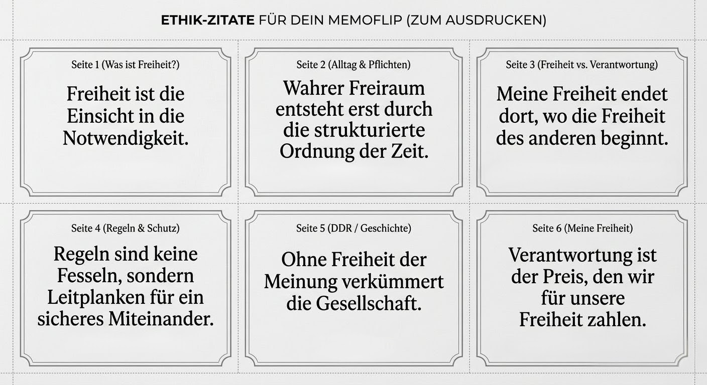

# Ethik-Projekt: Memoflip zum Thema Freiheit

> [!IMPORTANT]
> **Hinweis zur Vollständigkeit:** Dieses Projekt befindet sich in der stetigen Optimierung. Es können sich noch Fehler in den Texten oder den KI-generierten Illustrationen befinden. Diese werden in kommenden Updates regelmäßig korrigiert.Solltest du Fehler finden, freue ich mich, wenn du mir eine Nachricht auf Telegram (@ToxicLemonV1) schreibst, damit ich sie ausbessern kann.
>
> 
Dieses Repository enthält die vollständige Ausarbeitung, die Texte und die strukturierten Quellen für mein Ethik-Projekt in der 7. Klasse. Das Projekt wurde als Memoflip umgesetzt.

---

## Projektmaterialien

Hier findest du die digitalen Assets, die zur Gestaltung des Memoflips verwendet wurden:

### Comic-Illustrationen
*Diese wurden mithilfe von KI erstellt und dienen der visuellen Unterstützung der jeweiligen Fragestellungen.*

### Zitat-Sammlung
*Wichtige Aussagen und philosophische Ansätze, die im Projekt verarbeitet wurden.*

---

## Seitenstruktur und Quellenverzeichnis

*   **Deckblatt: Freiheit** | Quelle: Eigene Gestaltung.
*   **Seite 1: Was ist Freiheit** | Quellen: Leben Leben 2, S. 67 (Curse), S. 68 (positive/negative Freiheit).
*   **Seite 2: Freiheit im Alltag** | Quellen: Leben Leben 2, S. 64 (Mehmet), S. 70 (Grenzen), S. 71 (Zwang).
*   **Seite 3: Freiheit vs. Verantwortung** | Quellen: Leben Leben 2, S. 62-63 (Esra/Marc), S. 74 (Autonomie).
*   **Seite 4: Freiheit und Regeln** | Quelle: Leben Leben 2, S. 69 (Grundrechte).
*   **Seite 5: Freiheit in der Geschichte** | Quelle: Eigene Internetrecherche (DDR).
*   **Seite 6: Meine Freiheit** | Quelle: Eigene Reflexion.

---

## Kontakt & Support
Bei Fragen zum Projekt oder für den Austausch über das Thema erreichst du mich über Telegram: [@ToxicLemonV1](https://t.me/ToxicLemonV1). Weitere Informationen zu meiner Schule findest du auf der [offiziellen Website der IGS Willy Brandt](https://igs-willy-brandt.de/).
